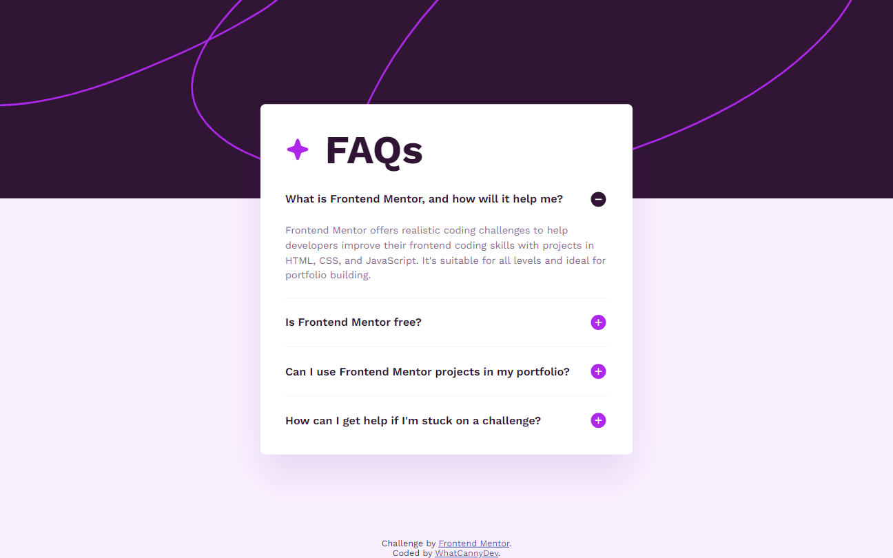

# Frontend Mentor - FAQ accordion solution

This is a solution to the [FAQ accordion challenge on Frontend Mentor](https://www.frontendmentor.io/challenges/faq-accordion-wyfFdeBwBz). Frontend Mentor challenges help you improve your coding skills by building realistic projects. 

## Table of contents

- [Overview](#overview)
  - [The challenge](#the-challenge)
  - [Screenshot](#screenshot)
  - [Links](#links)
- [My process](#my-process)
  - [Built with](#built-with)
  - [What I learned](#what-i-learned)
  - [Continued development](#continued-development)
  - [Useful resources](#useful-resources)
- [Author](#author)

## Overview

### The challenge

Your challenge is to build out this FAQ accordion and get it looking as close to the design as possible.

You can use any tools you like to help you complete the challenge. So if you've got something you'd like to practice, feel free to give it a go.

Users should be able to:

- Hide/Show the answer to a question when the question is clicked
- Navigate the questions and hide/show answers using keyboard navigation alone
- View the optimal layout for the interface depending on their device's screen size
- See hover and focus states for all interactive elements on the page

### Screenshot



### Links

- Solution Repository URL: [Add solution URL here](https://github.com/CannyRo/FrontendMentor_FaqAccordion_wyfFdeBwBz)
- Live Site URL: [Add live site URL here](https://cannyro.github.io/FrontendMentor_FaqAccordion_wyfFdeBwBz/)

## My process

### Built with

- Semantic HTML5 markup
- CSS custom properties
- Flexbox
- Mobile-first workflow
- BEM methodology

### What I learned

I've reviewed the management of backgrounds, and in particular the properties : 
- background-size
- background-position

And I learned how work tags :

```html
<details>
  <summary>Question or Title ?</summary>
  <p>Answer or detail</p>
</details>
```

### Continued development

Deepen my knowledge of Html tags to maintain faithful semantics and avoid recreating things that already exist... for example, here, the accordion is only in Html and Css. Javascript is not necessary, whereas many tutorials use simple Buttons and Divs with Javascript to manage the appearance of the hidden sections.

### Useful resources

- [How styling the Html details element](https://www.sitepoint.com/style-html-details-element/) - This helped me to understand how this details element works and how stylizes it.

## Author

- Website - [WhatCannyDev is searching a work-study contract in France](https://cannyro.github.io/hire_mr_canny/en)
- Frontend Mentor - [@CannyRo](https://www.frontendmentor.io/profile/CannyRo)
- GitHub - [@CannyRo](https://github.com/CannyRo)
- LinkedIn - [Ronan CANNY](https://www.linkedin.com/in/ronan-canny-b29443277/)

